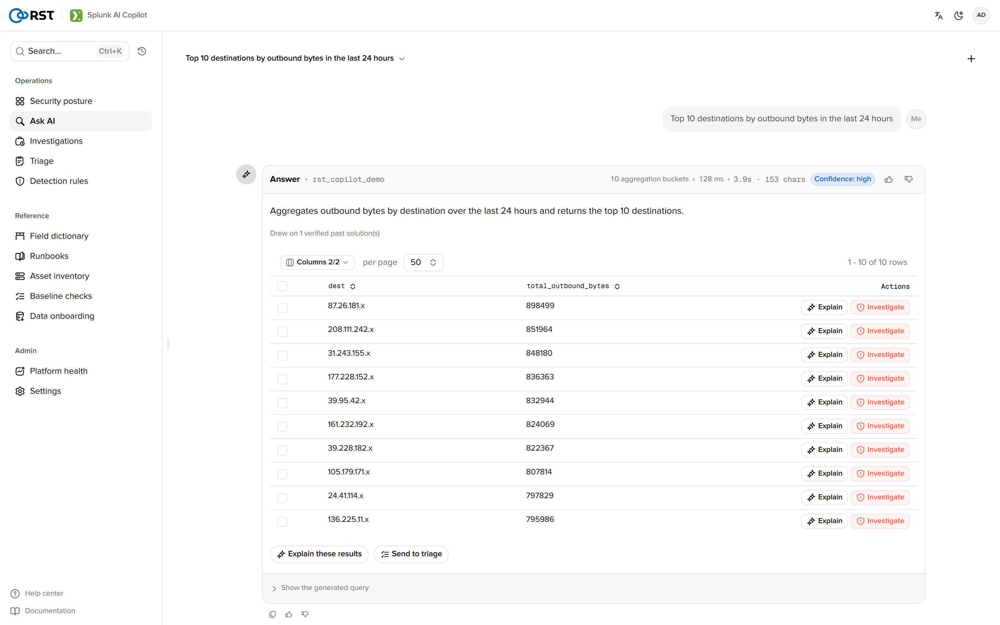
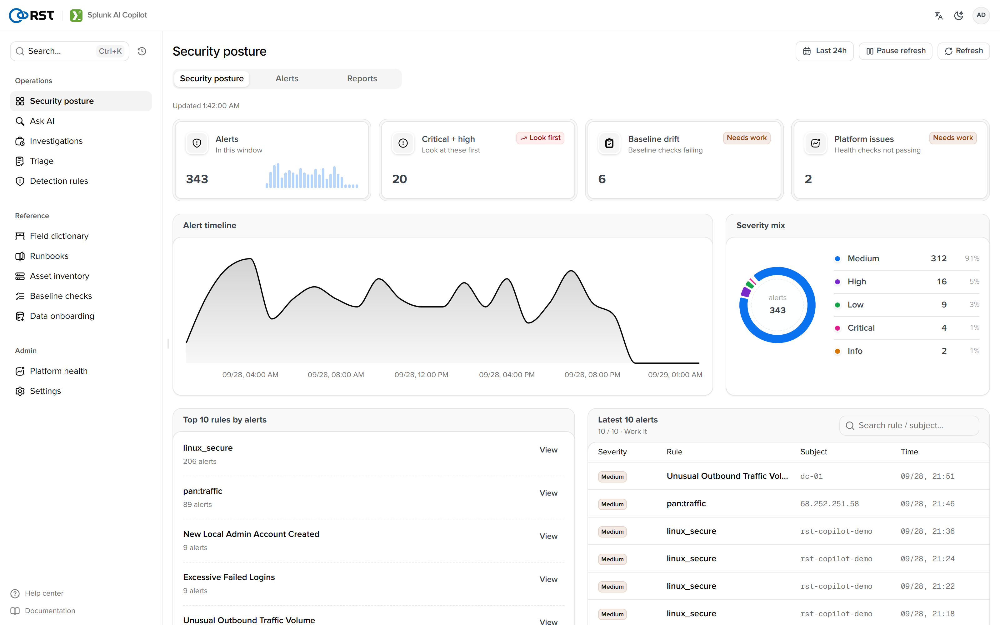
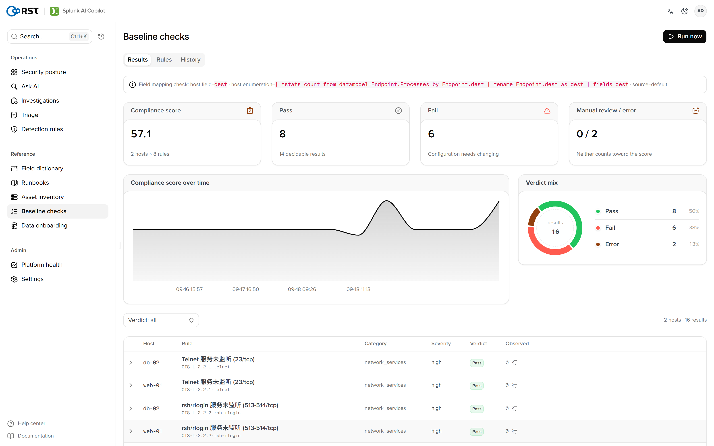
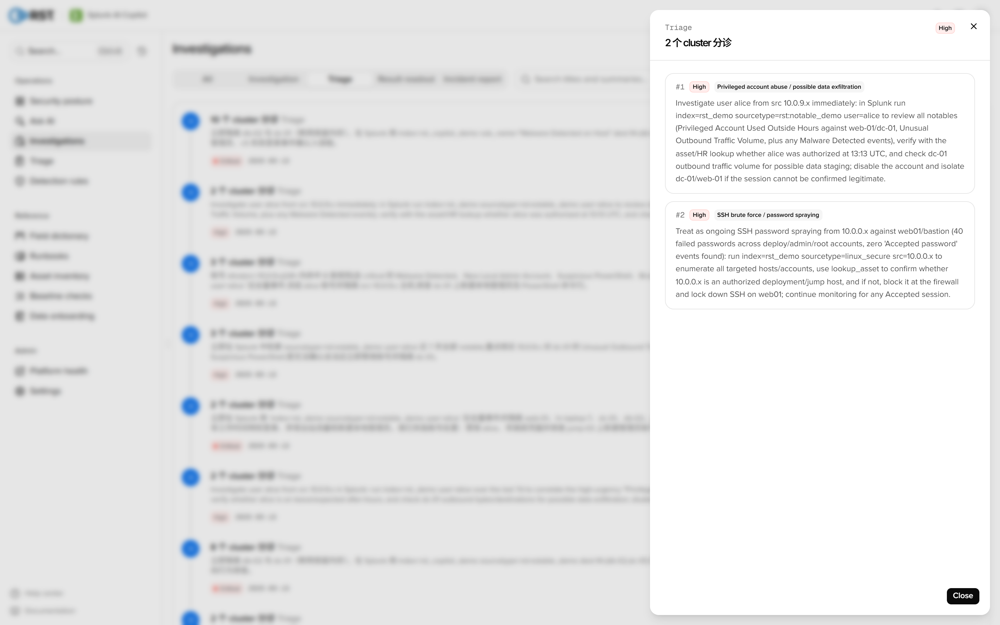
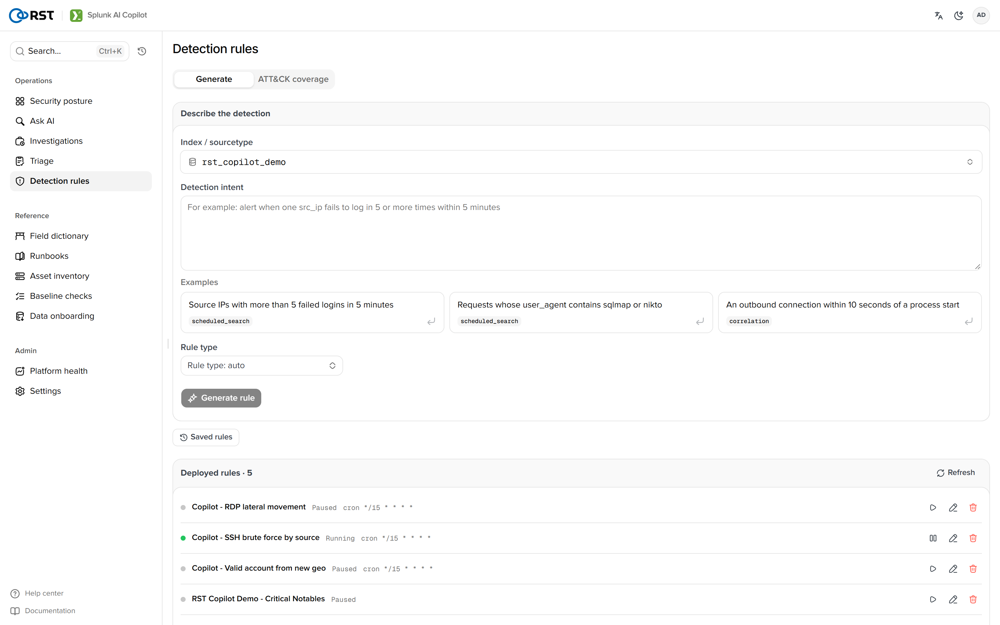
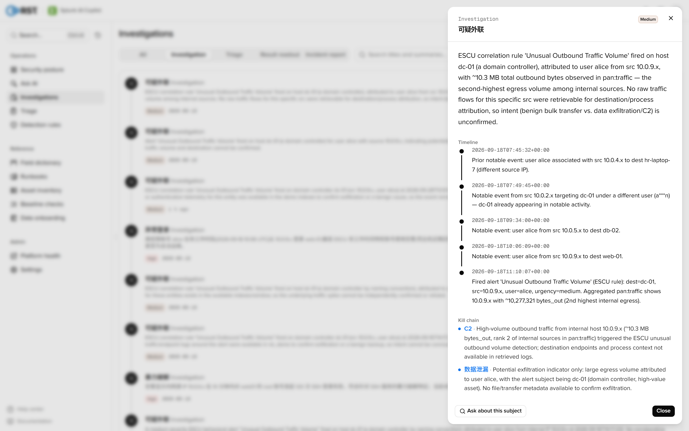

<p align="center">
  
</p>

<h1 align="center">RST AI Copilot for Splunk®</h1>

<p align="center">
  <b>Ask your Splunk data in plain language.</b><br>
  A native Splunk app for security operations on the indexes you already have:<br>
  natural-language search, alert triage and investigation, deployable detection rules. Read-only, air-gap ready, every model call audited.
</p>

<p align="center">
  <a href="https://github.com/reallysec/RST-AI-Copilot-for-Splunk/releases"></a>
  
  
  
  <a href="https://reallysec.com/en/docs/splunk-ai-copilot"></a>
</p>

<p align="center">
  <b>English</b> · <a href="README.zh-CN.md">简体中文</a> · <a href="https://reallysec.com/en/docs/splunk-ai-copilot">Docs</a> · <a href="https://github.com/reallysec/RST-AI-Copilot-for-Splunk/releases">Download</a> · <a href="https://github.com/reallysec/RST-AI-Copilot-for-Splunk/issues">Report an issue</a>
</p>

<p align="center">
  
</p>

## Why RST AI Copilot for Splunk

- **Runs inside the Splunk you already have.** A native app (`.spl`) on the search head — no sidecar, no new data store, no extra search engine. It reads your existing indexes and writes only its own KV store collections and a `copilot:audit` sourcetype.
- **Read-only by design.** Every generated search is validated as read-only before it runs, and an index allowlist bounds what the model may query.
- **Your data stays in your network.** Field masking runs before anything reaches the model. Point it at Volcengine Ark, any OpenAI-compatible endpoint, or a self-hosted vLLM / Ollama for fully air-gapped operation.
- **Every step is accountable.** Each model call is a metadata-only audit event, indexed natively at `index=_internal sourcetype=copilot:audit` — never the prompt body.

## Quick start

You need Splunk Enterprise 10.0–10.5 on the search head (10.2+ with Python 3.13 to get the agentic engine, automatic fallback below that), the `admin_all_objects` capability to install, and an OpenAI-compatible LLM endpoint the search head can reach ([full requirements](https://reallysec.com/en/docs/splunk-ai-copilot/install/requirements)). Splunk Cloud is not supported yet: the in-app online update would not pass Cloud vetting.

Each release on [Releases](https://github.com/reallysec/RST-AI-Copilot-for-Splunk/releases) carries these packages of the same version:

| Package | Use it for |
|---|---|
| `RST-AI-Copilot-for-Splunk-<version>-selfcontained.spl` | Splunk Enterprise on your own Linux x86_64 servers (recommended). Includes the agentic engine and bundles x86_64 Linux native libraries. |
| `RST-AI-Copilot-for-Splunk-<version>-fallback.spl` | Splunk Enterprise on Windows or ARM (aarch64) search heads, or where compiled components are not allowed. Pure Python. |
| `RST-AI-Copilot-for-Splunk-<version>-splunkbase.spl` | The fallback package as listed on Splunkbase: the in-app update is off and Splunk offers new versions under **Manage Apps**. |

Install it in Splunk Web (**Apps → Manage Apps → Install app from file**) and restart, or on the search head:

```bash
sha256sum -c RST-AI-Copilot-for-Splunk-<version>-selfcontained.spl.sha256
tar xzf RST-AI-Copilot-for-Splunk-<version>-selfcontained.spl -C $SPLUNK_HOME/etc/apps/
$SPLUNK_HOME/bin/splunk restart
```

Open the app, go to **Settings → AI settings**, add your LLM endpoint and key, and confirm the index allowlist. The home page carries a first-run checklist and one-click demo data.

There is one package for every edition. Without a licence it runs as the free Community Edition; importing a licence under **Settings → License** unlocks Professional or Enterprise in place, with no reinstall and no data migration.

## Features

Everything below is in the free Community Edition.

- **NL → SPL**: natural language to read-only SPL, with dry run, result and aggregation tables, and multi-turn follow-ups. On the agentic engine it probes the real schema and self-verifies the query before answering.
- **Log explain**: one raw event → log type, key fields, indicators, severity and next steps.
- **Field dictionary**: drill index → sourcetype → field with coverage, cardinality and sample values, read from live Splunk metadata.
- **Context for the model**: runbook / SOP knowledge base (RAG), Splunk's own saved searches, lookups, macros and data models synced in as RAG, and a solutions library of verified queries, so generated SPL uses your real names.
- **ATT&CK coverage heatmap**: deployed rules and ES correlation searches mapped onto the ATT&CK matrix.
- **Platform health**: a check-up of the Splunk deployment and the slowest scheduled searches.
- **Privacy controls**: field masking — `cloud` / `private` / `airgapped` — redacts IPs, emails, secrets and PII before anything reaches the model.
- **Data onboarding assistant**: raw samples → generated `props.conf` / `transforms.conf` with dry-run coverage on real data.
- **Search-bar commands**: `| copilot "question"` generates and runs read-only SPL; `| splexplain` explains a query and proposes a rewrite.
- **Team and trust**: three-tier RBAC (viewer / analyst / admin) with capability-gated writes, a native audit trail, and multi-turn conversation history in the KV store.

<table>
  <tr>
    <td></td>
    <td></td>
  </tr>
</table>

## Professional and Enterprise

Professional unlocks four AI engines and reports: **alert batch triage** (cluster by signature and entity, score and rank), **alert investigation** (agentic evidence gathering, timeline, MITRE ATT&CK attack chain, affected assets, false-positive verdict), a **detection-rule copilot** (intent → a deployable scheduled saved search with trigger and notable action), a **platform-ops copilot** (an AI read of the check-up and the SPL performance advisor), alert noise reduction, and scheduled reports. Enterprise adds organisation-scale integration. A trial is 14 days of every Enterprise feature on one search head: apply at [reallysec.com](https://reallysec.com/en/products/splunk-ai-copilot/trial), then paste the license key on the License page.

Paid features stay visible in the Community Edition: a paid page opens in preview with a sample result, and running it opens an upgrade dialog.

<table>
  <tr>
    <td></td>
    <td></td>
  </tr>
</table>

<details>
<summary><b>Compare editions</b></summary>

| | Community | Professional | Enterprise |
|---|:---:|:---:|:---:|
| Everything under [Features](#features) | ✅ | ✅ | ✅ |
| **Alert batch triage**: cluster by signature and entity, model-scored severity and false-positive verdicts | — | ✅ | ✅ |
| **Alert investigation**: timeline, attack chain, MITRE ATT&CK, affected assets, recommended actions | — | ✅ | ✅ |
| **Detection-rule copilot**: intent → deployable scheduled saved search with trigger and notable action | — | ✅ | ✅ |
| **Platform-ops copilot**: AI read of the Splunk check-up and SPL performance advisor | — | ✅ | ✅ |
| Alert noise reduction, reports and scheduled reports | — | ✅ | ✅ |
| ES Incident Review write-back | — | — | ✅ |
| Ticketing (ServiceNow / Jira) (Beta) | — | — | ✅ |
| MCP server | — | — | ✅ |
| Audit forwarding to syslog / webhook (SIEM, SOAR) | — | — | ✅ |
| Multi-provider LLM failover and health probing | — | — | ✅ |
| Offline / air-gapped activation | — | — | ✅ |
| Search heads | 1 | 1 | unlimited, incl. SHC |
| Model calls | unlimited (your own model) | unlimited | unlimited |

**Beta:** ticketing and Slack / Teams channels have so far been verified only against local stub endpoints, not against real ServiceNow, Jira, Slack or Teams.

The four engines ship encrypted; the decryption key comes with the licence and is bound to the host. Editions and purchase: [reallysec.com](https://reallysec.com/en/products/splunk-ai-copilot). Trials and licences: [console.reallysec.com](https://console.reallysec.com).

<p align="center">
  
</p>

</details>

## Data boundary

- The app runs inside Splunk. Ingress is Splunk Web; egress is the LLM endpoint you configure, plus `license.reallysec.com` when a licence is activated online (not needed with an offline licence).
- Every generated search is read-only and bounded by the index allowlist.
- Field masking runs before anything reaches the model; in `airgapped` mode nothing leaves the instance.
- Every model call is an audit event (`index=_internal sourcetype=copilot:audit`) carrying metadata only — never the prompt body — and can be forwarded to a SIEM (Enterprise).

## Supported versions

| Component | Supported |
|---|---|
| Splunk | Splunk Enterprise 10.0–10.5. The agentic engine needs 10.2+ with Python 3.13; below that a fully functional `requests` engine is used automatically. Tested on Splunk Enterprise 10.4.1, Python 3.13, RHEL 8 |
| Platform | The `selfcontained` package is Linux x86_64 only (bundles x86_64 native libraries); on Windows or ARM (aarch64), and for Splunkbase, use the `fallback` package |
| Splunk Free | Community features only. Paid features do not work: Splunk Free has no login, so scheduled jobs get no session key and the license heartbeat, scheduled reports and notifications never run |
| LLM endpoint | Volcengine Ark, any OpenAI-compatible API, self-hosted vLLM / Ollama |
| Install | Search head with the `admin_all_objects` capability |

## Support

- **Questions and bugs**: open an [issue](https://github.com/reallysec/RST-AI-Copilot-for-Splunk/issues). See [SUPPORT](SUPPORT.md) for where to ask what.
- **Security vulnerabilities**: do not open a public issue; follow the [security policy](SECURITY.md).

## Licence

RST AI Copilot for Splunk is proprietary software, free to use as the Community Edition under the [End User License Agreement](LICENSE). This repository holds the introduction and the release downloads; the source code is not published. "RST", "Reallysec", "斯普朗克" and the product logos are trademarks of Anhui Reallysec Information Technology Ltd. Splunk® is a registered trademark of Splunk LLC (a Cisco company) in the United States and other countries. RST AI Copilot for Splunk is a third-party app and is not affiliated with, sponsored by, or endorsed by Splunk LLC or Cisco.

© Anhui Reallysec Information Technology Ltd.
