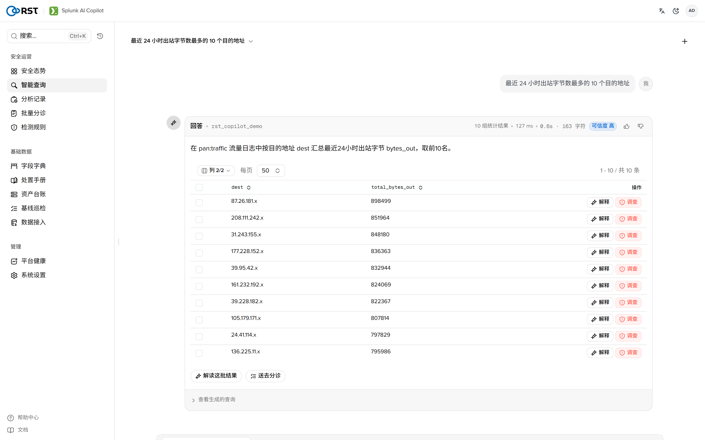
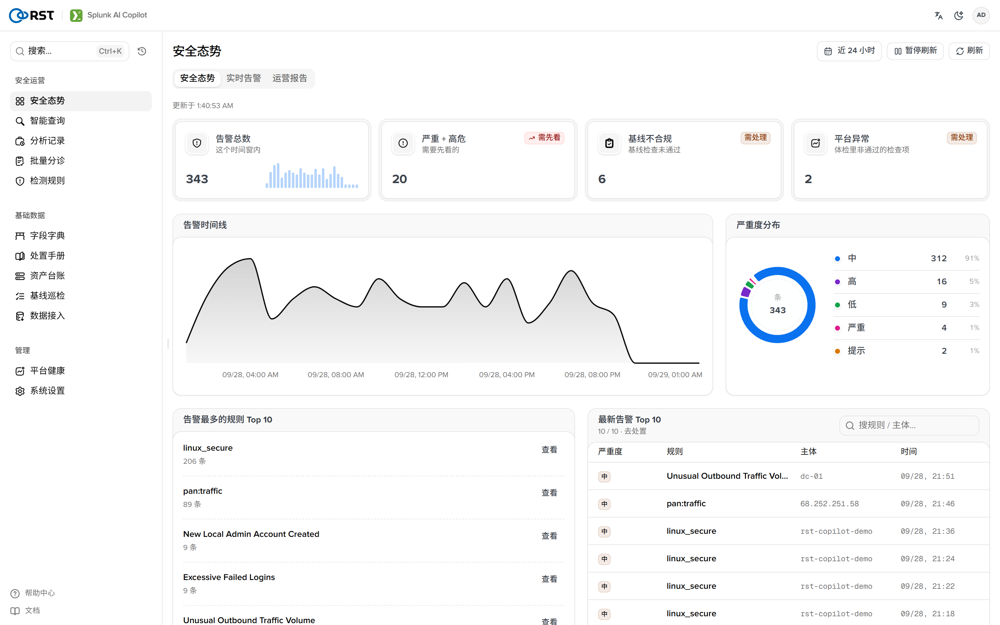
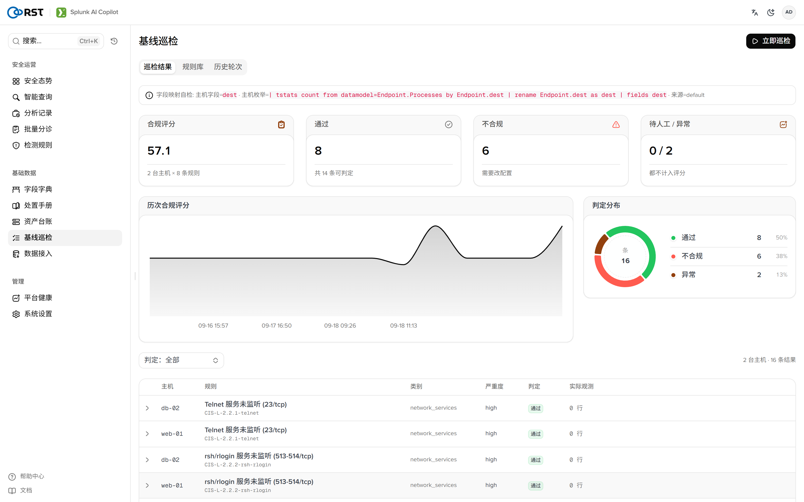
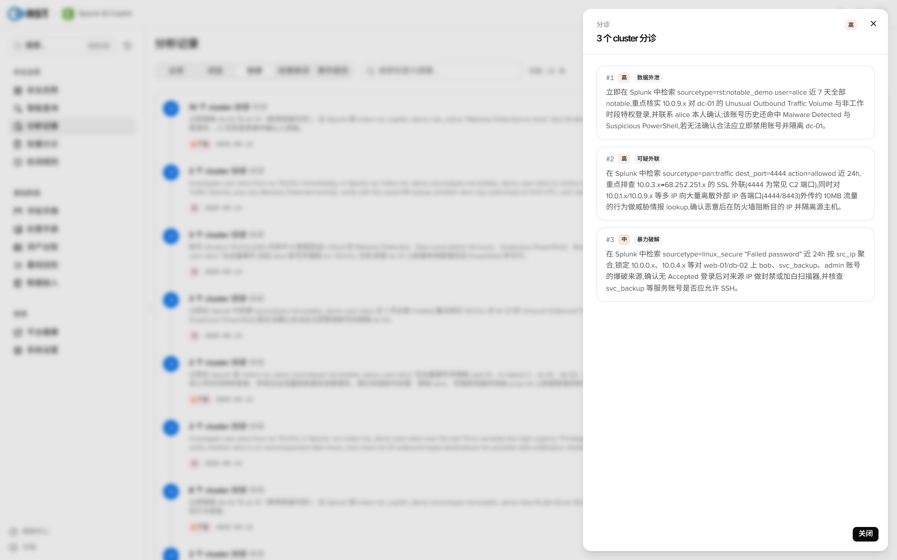
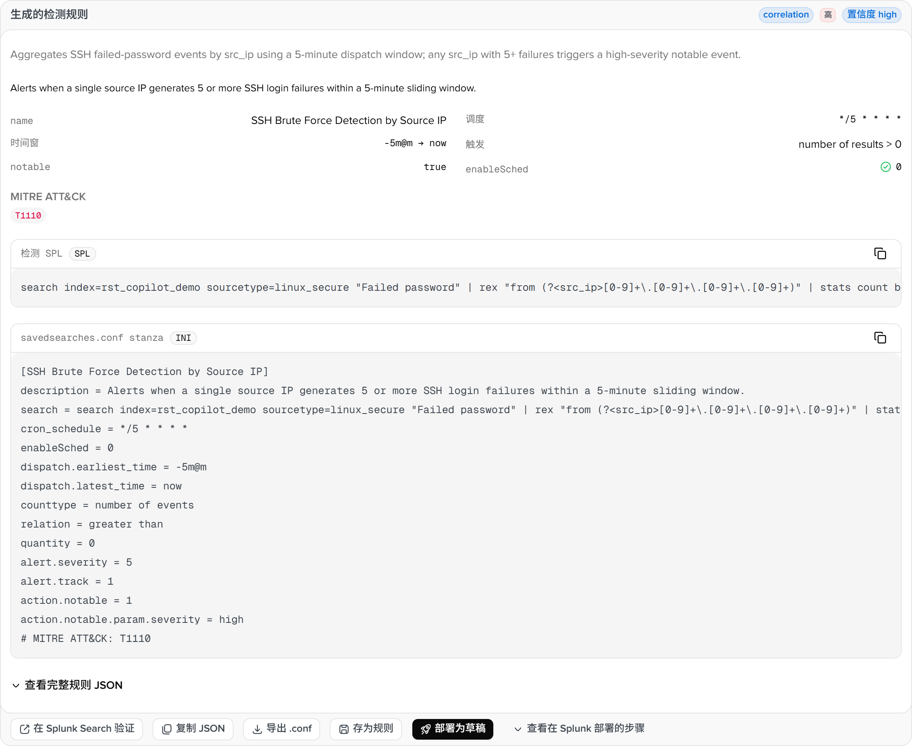
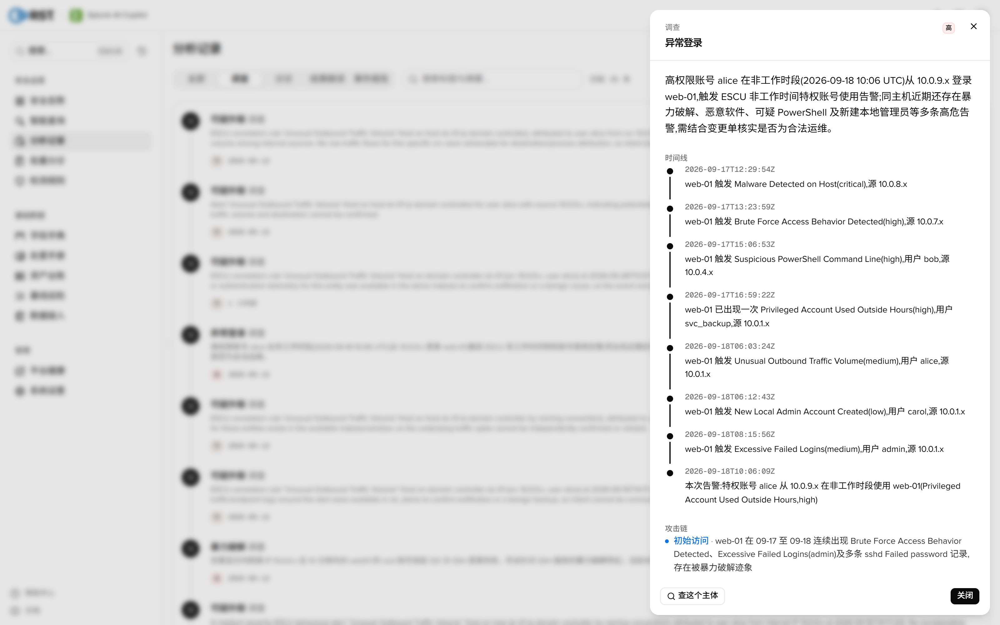

<p align="center">
  
</p>

<h1 align="center">RST Splunk AI Copilot</h1>

<p align="center">
  <b>用大白话查你的 Splunk 数据。</b><br>
  一个原生 Splunk 应用，直接在你现有的索引上做安全运营：<br>
  自然语言检索、告警研判与调查、可部署的检测规则。全程只读、支持离网、每次模型调用都留审计。
</p>

<p align="center">
  <a href="https://github.com/reallysec/RST-Splunk-AI-Copilot/releases"></a>
  
  
  
  <a href="https://reallysec.com/docs/splunk-ai-copilot"></a>
</p>

<p align="center">
  <a href="README.md">English</a> · <b>简体中文</b> · <a href="https://reallysec.com/docs/splunk-ai-copilot">文档</a> · <a href="https://github.com/reallysec/RST-Splunk-AI-Copilot/releases">下载</a> · <a href="https://github.com/reallysec/RST-Splunk-AI-Copilot/issues">反馈问题</a>
</p>

<p align="center">
  
</p>

## 为什么是 RST Splunk AI Copilot

- **跑在你现有的 Splunk 里。** 一个原生应用（`.spl`）装在搜索头上 —— 没有旁路网关、没有新存储、没有额外的搜索引擎。它读你现有的索引，只写自己的 KV store 集合和一个 `copilot:audit` sourcetype。
- **设计上只读。** 每条生成的检索在执行前都被校验为只读，索引白名单再框住模型能查的范围。
- **数据不出内网。** 脱敏在数据到达模型之前就完成。可对接火山方舟、任意 OpenAI 兼容端点，或自建 vLLM / Ollama 做完全离网运行。
- **每一步都可追溯。** 每次模型调用都是一条仅含元数据的审计事件，原生落在 `index=_internal sourcetype=copilot:audit` —— 从不记录提示词正文。

## 快速开始

需要搜索头上的 Splunk Enterprise 10.0–10.5（10.2+ 且 Python 3.13 才能用 agentic 引擎，低于此版本自动回退），安装所需的 `admin_all_objects` 权限，以及一个搜索头能访问的 OpenAI 兼容大模型端点（[完整要求](https://reallysec.com/docs/splunk-ai-copilot/install/requirements)）。暂不支持 Splunk Cloud：应用内在线更新无法通过 Cloud 审核。

[Releases](https://github.com/reallysec/RST-Splunk-AI-Copilot/releases) 的每个版本都带同一版本号的两个安装包：

| 安装包 | 适用场景 |
|---|---|
| `RST-Splunk-AI-Copilot-<version>-selfcontained.spl` | 自有 Linux x86_64 服务器上的 Splunk Enterprise（推荐），自带 agentic 引擎 |
| `RST-Splunk-AI-Copilot-<version>-fallback.spl` | Windows 或 ARM 搜索头、或不允许编译组件的 Splunk Enterprise 环境，纯 Python |

在 Splunk Web 里安装（**Apps → Manage Apps → Install app from file**）后重启，或在搜索头上：

```bash
sha256sum -c RST-Splunk-AI-Copilot-<version>-selfcontained.spl.sha256
tar xzf RST-Splunk-AI-Copilot-<version>-selfcontained.spl -C $SPLUNK_HOME/etc/apps/
$SPLUNK_HOME/bin/splunk restart
```

打开应用，进 **系统设置 → AI 配置**，填入大模型端点和密钥，确认索引白名单。首页带有首次使用清单和一键演示数据。

所有版本共用一个安装包。没有许可时就是免费的社区版；在 **系统设置 → 产品激活** 导入许可即可原地解锁专业版或企业版，不用重装，数据保留。

## 功能

以下全部包含在免费的社区版里。

- **NL → SPL**：自然语言转只读 SPL，带试跑、结果表与统计表、多轮追问。在 agentic 引擎上会探查真实字段结构、答题前自我校验查询。
- **日志研读**：一条原始事件 → 日志类型、关键字段、指标、严重度和后续步骤。
- **字段字典**：逐层下钻 索引 → sourcetype → 字段，附覆盖率、基数和样例值，读自 Splunk 实时元数据。
- **喂给模型的上下文**：处置手册 / SOP 知识库（RAG）、同步进 RAG 的 Splunk saved searches / lookups / macros / data models，以及沉淀已验证查询的方案库，让生成的 SPL 用你真实的名字。
- **ATT&CK 覆盖热力图**：把已部署规则和 ES 关联搜索映射到 ATT&CK 矩阵上。
- **平台健康**：Splunk 部署体检，以及最慢的定时搜索清单。
- **隐私控制**：字段脱敏 —— `cloud` / `private` / `airgapped` —— 在数据到达模型前脱去 IP、邮箱、密钥和 PII。
- **数据接入助手**：原始样本 → 生成 `props.conf` / `transforms.conf`，并在真实数据上试跑覆盖率。
- **搜索栏命令**：`| copilot "问题"` 生成并运行只读 SPL；`| splexplain` 解释一条查询并给出改写建议。
- **团队与信任**：三档 RBAC（viewer / analyst / admin）、写操作按 capability 闸控、原生审计流水、KV store 里的多轮会话历史。

<table>
  <tr>
    <td></td>
    <td></td>
  </tr>
</table>

## 专业版与企业版

专业版解锁四个 AI 引擎和报表：**告警批量研判**（按签名与实体聚类、评分排序）、**告警调查**（agentic 自主取证、时间线、MITRE ATT&CK 攻击链、受影响资产、误报判定）、**检测规则副驾**（意图 → 可部署的定时 saved search，带触发条件和 notable 动作）、**平台运维副驾**（对体检结果的 AI 解读和 SPL 性能顾问），以及告警降噪和定时报告。企业版再加组织级集成。试用为一个搜索头上 14 天的企业版全功能，在[官网](https://reallysec.com/products/splunk-ai-copilot/trial)申请，再把许可密钥粘贴到激活页。

社区版里付费功能照样看得见：付费页面以预览模式打开，带一份示例结果，点运行会弹出升级提示。

<table>
  <tr>
    <td></td>
    <td></td>
  </tr>
</table>

<details>
<summary><b>版本对比</b></summary>

| | 社区版 | 专业版 | 企业版 |
|---|:---:|:---:|:---:|
| [功能](#功能)一节的全部能力 | ✅ | ✅ | ✅ |
| **告警批量研判**：按签名与实体聚类，模型评分的严重度与误报判定 | — | ✅ | ✅ |
| **告警调查**：时间线、攻击链、MITRE ATT&CK、受影响资产、推荐动作 | — | ✅ | ✅ |
| **检测规则副驾**：意图 → 可部署的定时 saved search，带触发条件和 notable 动作 | — | ✅ | ✅ |
| **平台运维副驾**：对 Splunk 体检的 AI 解读和 SPL 性能顾问 | — | ✅ | ✅ |
| 告警降噪、报表与定时报告 | — | ✅ | ✅ |
| ES Incident Review 写回（Beta） | — | — | ✅ |
| 工单（ServiceNow / Jira，Beta） | — | — | ✅ |
| MCP 服务 | — | — | ✅ |
| 审计转发到 syslog / webhook（SIEM、SOAR，Beta） | — | — | ✅ |
| 多提供方大模型故障转移与健康探测（Beta） | — | — | ✅ |
| 离线 / 气隙激活 | — | — | ✅ |
| 搜索头数 | 1 | 1 | 不限，含 SHC（未测试） |
| 模型调用次数 | 不限（用你自己的模型） | 不限 | 不限 |

**Beta：** ES Incident Review 写回、工单、Slack / Teams 通道、审计转发和大模型故障转移目前只在本地模拟端点（stub）上验证过，尚未在真实的 Enterprise Security、ServiceNow、Jira、Slack、Teams、SIEM 或第二家大模型服务上验证。通过 deployer 安装到搜索头集群尚未测试。

四个引擎以密文形式发布，解密密钥随许可下发并绑定主机。版本与购买：[reallysec.com](https://reallysec.com/products/splunk-ai-copilot)。试用与许可：[console.reallysec.com](https://console.reallysec.com)。

<p align="center">
  
</p>

</details>

## 数据边界

- 应用跑在 Splunk 内部。入站是 Splunk Web；出站是你配置的大模型端点，以及在线激活许可时的 `license.reallysec.com`（离线许可则不需要）。
- 每条生成的检索都是只读，并被索引白名单框住。
- 脱敏在数据到达模型之前完成；`airgapped` 模式下什么都不出实例。
- 每次模型调用都是一条审计事件（`index=_internal sourcetype=copilot:audit`），仅含元数据 —— 从不记录提示词正文 —— 可转发到 SIEM（企业版）。

## 支持的版本

| 组件 | 支持范围 |
|---|---|
| Splunk | Splunk Enterprise 10.0–10.5。agentic 引擎需 10.2+ 且 Python 3.13；低于此版本自动使用功能完整的 `requests` 引擎。实测环境：Splunk Enterprise 10.4.1、Python 3.13、RHEL 8 |
| 平台 | `selfcontained` 安装包只支持 Linux x86_64；Windows 或 ARM 请用 `fallback` 安装包 |
| Splunk Free | 只能用社区版功能。付费功能不可用：Splunk Free 没有登录，定时任务拿不到会话 key，许可心跳、定时报表和通知都不会运行 |
| 大模型端点 | 火山方舟、任意 OpenAI 兼容 API、自建 vLLM / Ollama |
| 安装 | 具备 `admin_all_objects` 权限的搜索头 |

## 支持

- **提问与报错**：开一个 [issue](https://github.com/reallysec/RST-Splunk-AI-Copilot/issues)。什么问题去哪问，见 [SUPPORT](SUPPORT.md)。
- **安全漏洞**：不要公开提 issue；按 [安全策略](SECURITY.md) 走。

## 许可

RST Splunk AI Copilot 是专有软件，依据 [最终用户许可协议](LICENSE) 可免费以社区版使用。本仓库只放产品介绍和版本下载，不公开源代码。"RST"、"Reallysec"、"斯普朗克" 及产品标识为安徽斯普朗克信息技术有限公司的商标。Splunk 是其各自所有者的商标；本项目为第三方应用，与 Splunk 无隶属或背书关系。

© 安徽斯普朗克信息技术有限公司
